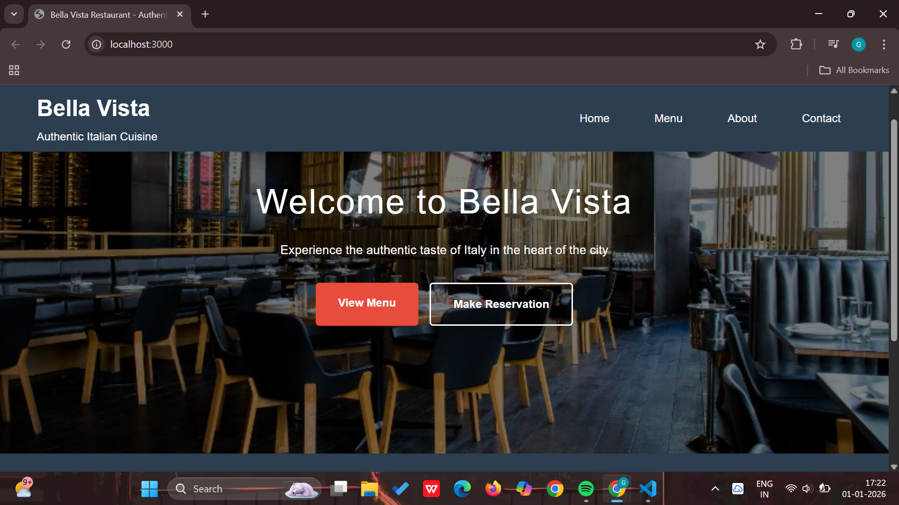
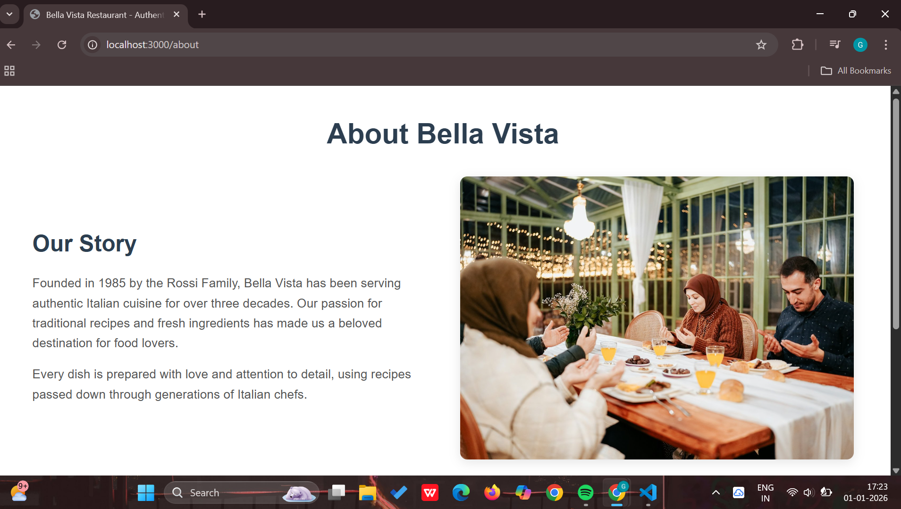
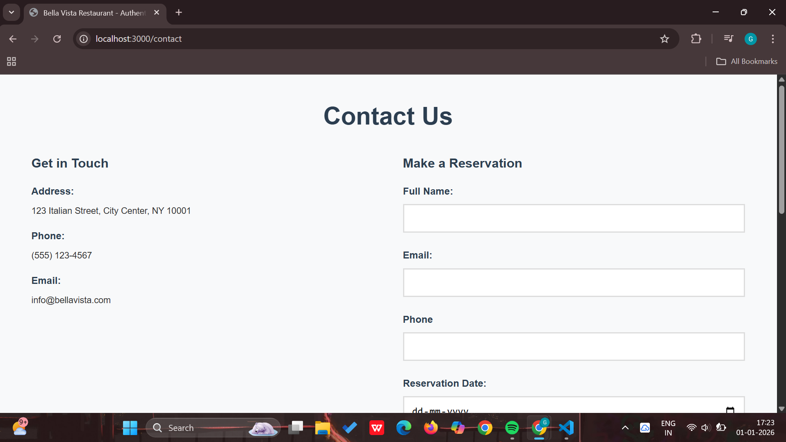
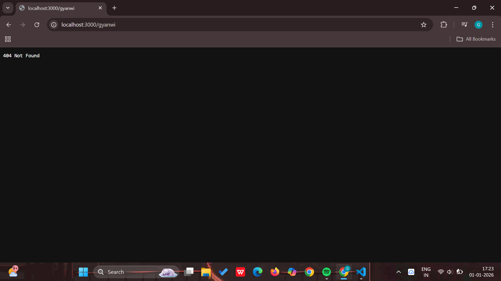

# Assignment 6 – Simple Web Server using Node.js

## To start the application
npm init

## To install nodemon
npm i nodemon

## To run the application
npm run dev

## Screenshots

### Server Running

### Home Page

### About Page

### Contact Page

### 404 Page

